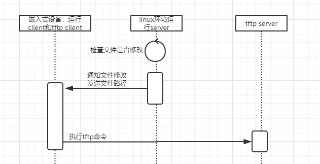

## web页面自动tftp工具
　　用于嵌入式设备上高效的调试页面，本地页面文件修改后，会自动tftp到嵌入式设备里面，浏览器刷新即可马上看到效果  

## 原理图
  

## 编译  
* 直接make编译所有  
* make client_only 单独编译client  
* make server_only 单独编译server
* 交叉编译客户端，指定CC即可，如 make client_only CC=/opt/bin/mipsel-linux-gcc  

## 使用方法
**服务器运行**  
在本地web目录下，运行服务器，支持的参数如下  
example: server -p 12345  
-p :listen port  
-P :path (default './')  
-t :check interval (default 2s)  
-i :ignore config file, default ignore.conf  
-d :debug level[0-5]  

**客户端运行**  
在嵌入式设备的web目录，运行客户端，支持的参数如下  
example: client -c 192.168.178.4 -p 12345 -t 192.168.10.123  
-p :connect port, file monitor server port  
-t :tftp server ip  
-d :debug level[0-5]  

